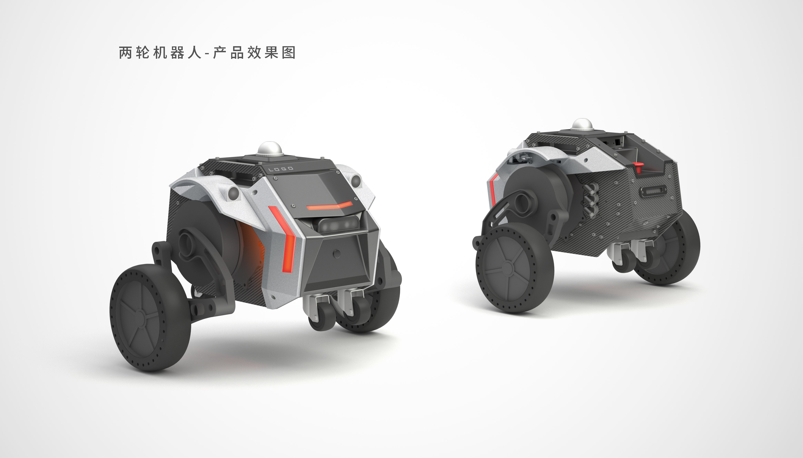

<p align="center"><strong>HCX ROS2</strong></p>
<p align="center">
  
  
</p>

<p align="center">
    语言：<a href="./docs/docs_en/README_EN.md"><strong>English</strong></a> / <strong>中文</strong>
</p>

​	基于diablo平台的 `HCX` 机器人支持2D的室内外自主导航功能，您可以通过 `ROS2` 快速上手。如果您不准备使用 `ROS` 进行开发，也可以通过在 [ROS](https://github.com/DDTRobot/diablo-sdk-v1) 中修改 `CMakeLists` 的方式仅对源码进行编译。我们将持续更新 `HCX` 机器人的 `ROS2` 的功能节点 , 希望能对您的机器人开发有所帮助。

---



## Basic Information 基本信息

- Ubuntu20.04
- ros2 galactic
- `ROS_DOMAIN_ID=5` , 可通过 `export ROS_DOMAIN_ID=5` 连接并控制局域网中 `DIABLO` 的功能节点。

## 整机配置

- 高性能运算平台 NUC
- RGB-D深度相机 RealSense系列
- 比肩多线的高性能激光雷达 Livox系列
- 4G 远程FPV摄像头
- 4G 高清数字图传一体远程遥控器
- 独立4G DTU模块（自带路由器）

## Installation 安装

| Installation method | Supported platform[s] | Development Docs    | Official website                         |
| ------------------- | --------------------- | ------------------- | ---------------------------------------- |
| Source              | Linux , ros-galactic  | [HCX 开发手册](https://hcx-sdk-docs.readthedocs.io/zh_CN/latest/index.html) | [TIANBOT](https://tianbot.com/) |

您可以在大多数 `Linux` 设备中编译我们的 `Meta ROS Package` 源码。或者在支持 ros-galactic 的设备中直接编译我们提供的 ros 包。

## Quick Start 快速开始

1. 创建ros工程文件夹

```bash
#make sure you have build all dependence.

sudo apt-get install python3-colcon-common-extensions
mkdir -p ~/diablo_ws/src
cd ~/diablo_ws/src

#clone API source code
git clone -b basic https://github.com/tianbot/diablo_ros2.git

source /opt/ros/galactic/setup.bash
cd ~/diablo_ws
colcon build
source install/setup.bash

#before starting the node , please check of serial port in diablo_ctrl.cpp is correct.
ros2 launch diablo_bringup diablo_bringup.launch.py

#run controller python script
ros2 run diablo_teleop teleop_node 
```

## Contents 目录

以下为Ros2 节点目录 :

### diablo_bringup
* [机器人ROS基础驱动模块](./diablo_bringup/)

### diablo_convert
* [机器人运动控制消息转换模块](./diablo_convert/)

### diablo_description
* [机器人TF坐标变换模块](./diablo_description/)

### diablo_led
* [机器人氛围灯控制模块](./diablo_led/)

### diablo_mqtt
* [机器人mqtt平台通信模块](./diablo_mqtt/)

### diablo_navigation2
* [机器人2D导航模块](./diablo_navigation2/)
  > navigation2   (Navfn + DWB) 等

### diablo_odom
* [机器人轮式里程计模块](./diablo_odom/)

### diablo_rviz
* [机器人常用可视化配置模块](./diablo_rviz/)

### diablo_slam
* [机器人环境感知模块](./diablo_slam/)
  > gmapping

  > slam_toolbox

  > cartographer

### diablo_visualise
* [机器人URDF模型及gazebo仿真模块](./diablo_navigation2/)
  > navigation2   (Navfn + DWB)

### diablo_basic
* [机器人传感器感知模块](./diablo_ception)

  > [机器人内置传感器](./diablo_ception/diablo_body)

* [机器人SDK与通用方法模块](./diablo_common)

* [机器人控制交互模块](./diablo_interaction)

  > [获取机器人SDK控制权限](./diablo_interaction/diablo_ctrl)
  >
  > [捕获键盘输入信息](./diablo_interaction/diablo_teleop)

* [ROS自定义消息模块](./diablo_interfaces)

  > [机器人基础控制信息](./diablo_interfaces/motion_msgs)

* [Ros可视化仿真模块](./diablo_visualise)

  > [Ros rviz2 gazebo simulation](./diablo_visualise/diablo_simulation)
  >
  > ~~[Rviz2 自定义遥控器界面](./diablo_visualise/diablo_rviz2_plugin)~~
  >
  > [电机角度转Rviz2显示角度](./diablo_visualise/diablo_simpose_trans)